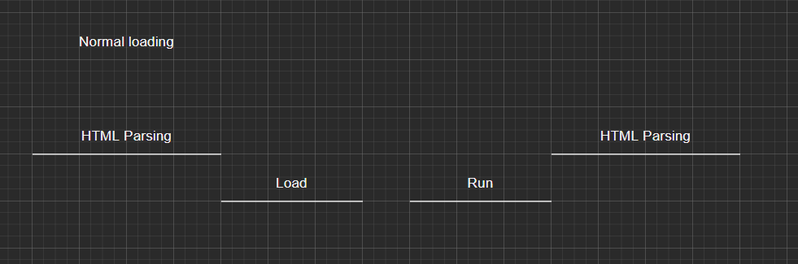
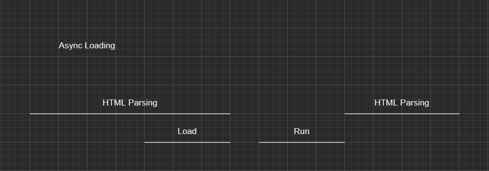
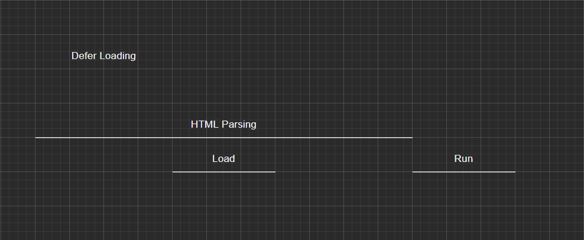

# Modular Programming with JavaScript

## 1. What are Modules and Their Advantages ?
## 2. Review of Important JavaScript OOP concepts
## 3. Module Design Pattern
## 4. Designing Simple Modules
## 5. Module Augmentation
## 6. Clonin, Inheritance and Submodules
## 7. Base, Sandbox and Core Modules
## 8. Application Implementation - Putting It All Together
## 9. Modular Application Design and Testing
## 10. Enterprise Grade Modular Design, AMD, CommonJS and ES6 Modules

---

# 3. Module Design Pattern

## Internal private scope in module pattern

Module pattern enables us to create a private scope for our code inside a function while providing controlled acccess to such a private scope through an interface. This interface can be in the form of a returned singleton object.

Example of internal private scoping inside a module:

```JavaScript
const mySingletonObj = () => {
    // private variables
    let name = "Sasan";
    let title = "Software Developer";

    // returning a singleton
    return {
        name: "Tom",

        // privileged method
        getOuterName: function() {
            return name;
        },

        // privileged method
        getInnerName: function() {
            return this.name;
        }

        // privileged method
        getTitle: function() {
            return this.title;
        }
    }
}();

console.log(mySingletonObj.name); // displays "Tom"
```

However, if we try to access the same property, using the method property on the intreface, a different value will be returned. Have a look at the following code snippet:

```JavaScript
console.log(mySingletonObj.getOuterName()); // displays "Sasan"
```

As you can see, the value returned from this method is the value for the ```name`` property from the outer scope of the interface, which is the scope of the ocntianer function. This can be rather confusing.

If the intent is to return the value for the name property which is defined inside the singleton object itself (the interface), we need to qualify the prperty using the ```this``` keyword.

We can add a second new method to our module:

```JavaScript
getInnerName: () => {return this.name;}
```

In this method, we specificallky qualify the ocntext for ```name``` using the ```this``` keyword, which references the context of the singleton object itself as opposed to the containing function. Thus, if we run the following code:

```JavaScript
console.log(mySingletonObj.getInnerName()); // displays "Tom"
```

The value assigned to ```name``` in the ocntext of the singleton object is returned. This is an important distinction to keep in mind.

## Creating loose coupling among modules

In a modular design, an application is often created using many modules. In order for these modules to work together, we need to create coupling among them, iwthout the modules being tightly dependent on each other.

We will start by creating our core application module and calling it ```ApplicationInitModule```. Usually, the very first step in running an application is to take care of the application's initialization tasks. Our ```ApplicationInitModule``` will be designed to do just that.

In the following code snippet, when ```ApplicationInitModule``` is started, it will in turn start all the registered modules and their initialization routines. this process will take care of the application's initialization routine as a whole.

```JavaScript
const ApplicationInitModule = (
    () => {
        const registeredModules = [];

        return {
            registerModule: function(module) {
                registeredModules.push(module);
            },
            getAppModulesCount: function() {
                return registeredModules.length;
            },
            removeRegisteredModule: function(index) {
                registeredModules.splice(index, 1);
            },
            initializeAllModules: function() {
                for (const module in registeredModules) {
                    registeredModules[module].initialize();
                }
            }
        }
    }
)();


const GlobalApp = (
    () => {
        const registerModule = ApplicationInitModule.registerModule;

        return {
            registerModule: registerModule
        }
    }
)();


const testModule1 = (
    () => {
        const self = {};
        const moduleName = "Module 1";

        self.initialize = function() {
            console.log("testmodule1 has been initialized!");
            console.log(`module name is ${moduleName}`);
        };

        (
            () => {
                GlobalApp.registerModule(self);
            }
        )();

        return {
            initialize: self.initialize,
            getName: function() {
                return moduleName;
            }
        }
    }
)();


const testModule2 = (
    () => {
        const moduleName = "Module 2";

        function initialize() {
            console.log("testmodule2 has been initialized");
        }

        return {
            initialize: initialize
        }
    }
)();

GlobalApp.registerModule(testModule2);

ApplicationInitModule.initializeAllModules();
```

### Application core module

The code starts by defining ```ApplicationInitModule``` as an application initializer module. The purpose of this module is to register all the available modules in the application (store them in an array) and then initialize them all (one at a time), when the application runs.

This module also provides an interface with some hooks for the external code to interact with. As you can see, there are methods to register a module, get the count of all the modules registered in the app for initialization, and remove a module from the list of registered modules; of course, there is also a method to initialize all modules that have been registered with the app.

### Application Mediator module

Our ```GlobalApp``` module also uses an IIFE to return a singleton object as the interface to the module. The whole purpose of this module is to act as a mediator (abstraction layer) between ```testModule1```, ```testModule2``` adn our core module ```ApplicationInitModule```.

We have designed the application this way so we can create a loose coupling between our core module and the other registered modules. As you can see, ```GlobalApp``` has been designed as a very thing layer.

This thin layer allows us to change our code module (```ApplicationInitModule```) as we please and even change its interface to the outside world, without affecting the other modules that rely on this module's functionality.

In our design, the only module which relies direclty on the ```ApplicationInitModule``` interface is our ```GlobalApp``` module. This means that, if there are any changes to the interface of ```AppliationInitModule```, we only need to make modificaitons to our thin mediate layer ```GlobalApp```. All the other modules in the application will be unaffected, as they still use the same thin layer interface provided by ```GlobalApp```.

### Application non-core modules

In our application implementation, we have created two simple modules that register themselves with the core module and really do nothing other than announcing to the world that they have been initialized.

### testModule1 implementation

In ```testModule1```, we have created an empty object called ```self```, which gets augmented with a method called ```initialize```. This is the method that will be called when our core module tries to initialize this module.

The registration of this module with the core module happens using an internal IIFE, which in turn calls our mediator module ```GlobalApp``` with a reference to the object ```self```. This is implemented as shown below:

```JavaScript
(
    () => {
        GlobalApp.registerdModule(self);
    }
)();
```

Of course, the ```GlobalApp.registerModule``` method is in fact a reference to the core module's method, ```ApplicationInitModule.registerModule```. However, ```testModule1``` does not know that and is only aware of the ```GlobalAppp``` provided interface, ```GlobalApp.registerModule```.

We have also used an IIFE to return an interface to this module, which is available through the ```testModule1``` variable.

Note that the interface provides two properties. One is a reference to the ```self.initialize``` method of the module and the other, ```getName```, simply returns the value of the encapsulated and hidden ```moduleName``` variable. Also note that ```moduleName``` is not a property on the ```self``` object. Instead, it is implemented as a containing function's property.

### testModule2 implementation

Our ```testModule2``` is implemented a little differently in comparison to ```testModule1```. As shown in the code, we have simply defined a function inside our module called ```initialize``` that is exposed to the external code indirectly through the interface returned from our IIFE for this module.

In our ```testModule2```, the ```moduleName``` variable is completely sealed from the outside world as there are no methods defined on the interface to provided access to this variable.

There is also no internal IIFE that registed the module with our core module, ```ApplicationInitModule```, thus we need to make a call outside of our module definition to achieve this task, as shown here:

```JavaScript
GlobalApp.registerModule(testModule2);
```

Notice that we have used our mediator module ```GlobalApp``` for this registration again and we are not directly calling the related method on the core module. This allows us to still preserver our loose coupling among the modules.

# 5. Module Augmentation

Module augmentaiton allows us to extend our modules without the need to change the original implementation. There are different techniques which can be used to implement module augmentation, and we will cover a couple of them in this chapter.

Module augmentation can be very useful when working on projects that have many contributors to the code base. This type of projects usually require us to extend our module by adding new code and functionality to what has been already developed by other developers.

## Implementing module augmentation 

Imagine that we have a module called ```ModuleA``` and, as a developer, you want to add more functionality to this module. However, for some reason, you decide to implement this new functionality in a compeltely separate module and then dynamically augment the original module with all the data and capabilities of this new module. You can achieve this as shown here:

```JavaScript
const moduleA = (coreModule) => {
    let someData = "some data";

    coreModule.someMethod = () => {
        return someData;
    };

    return coreModule;
}(moduleA);
```

## Loose agumentation of modules

When we try to enhance a module using the agumentation technique previously discussed, we pass a reference of the module to another part of our code which is responsible for doing the augmentation work.

How can we add functionality to an object that has not been loaded or created yet ?

The answer to this question becomes very important when our modules ( files ) are loaded in an asynchronous fashion, and we have no way of making sure that our original module is loaded before the augmentation code that enhances the modules.

One of the beautiful and powerful aspects of JavaScript is its ability to add properties to objects dynamically, at any time during code exeuction. This allows us to add functionality or modify our original module's implementation even before the module is loaded, as long as we provide a temporary object in the absence of the module. This temporary object will be added to the original module after the module is loaded ( or more accurately, it becomes one with the original module ).

If it sounds complicated, it really is simpler than you think. Let's revisit our previous augmentin code and examing it a little closer:

```JavaScript
((coreModule) => {
    coreModule.someText = "this is a test for module augmentation;
    coreModule.getExtendedModuleMsg = () => {
        console.log(coreModule.someText);
    }

    return coreModule;
})(someCoreModule);
```

I mentioned that for the augmentation to work properly, we needed to load this code, which is responsible for augmenting the ```someCoreModule``` module after the original module is loaded. Otherwise, a code execution error will be thrown. While that remains true, what if we compensate for when ```someCoreModule``` does not yet exist in the application by using an empty object ?

As you probably know, we can call a function as follows:

```JavaScript
someFunc(someParameter || someOtherParameter);
```

When we do this, we are telling the JavaScript interpreter to pass ```someParameter``` when calling ```someFunc```, if it has a value; and if not, pass ```someOtherParameter``` to the function. This is how the ```||``` operator works in the preceding code snippet.

We can use the same technique and pass an empty object to our anonymous function, as follows:

```JavaScript
(someCoreModule || {});
```

We tell the interpreter to pass a reference of our ```someCoreModule``` object when calling the function, if the object exists, or pass a reference of an empty object which will replace our original module for the time being.

## Tight augmentation of modules

Tight augmentation is used for adding properties ( functionality ) to our modules when we do want to enforce a set order of file loading and code exeuction, and therefore it is **less flexible**. This type of augmentation is usually used when we need to make sure that a certain property from the original module is available for our augmenting code.

Consider our augmenting code for ```someCoreModule``` module from the previous seciton, hwne loose augmentation was being used. As mentioned previously, since we are passing a reference to ```someCoreModule``` or an empty anonymous object into our IIFE, we can load our original module and our augmenting code in any order that we like.

This was shown as follows:

```JavaScript
const someCoreModule = ((coreModule) => {
    coreModule.someText = "this is a test for loose module augmentation";
    coreModule.getExtendedModuleMsg = () => {
        console.log(coreModule.someText);
    }
    
    return coreModule;
})(someCoreModule || {});
```

However, this also means that if we wanted to override one of the original module's properties, depending on what code gets loaded and exeucted first ( the original module or the augmenting code ), our "override" might be overridden by another piece of code, unintentionally and unexpectedly.

To understand this better, think of a file ```module_3.js``` and add the following code to it:

```JavaScript
((coreModule) => {
    coreModule.someText = "this is a test for overriding module properties with loose augmentation";
    coreModule.getExtendedModuleMsg = () => {
        console.log(coreModule.someText);
    }

    return coreModule;
})(someCoreModule || {});
```

Also, let's laod this file in our application as follows:

```HTML
<script type="text/javascript" async src="js/module_3.js></script>
<script type="text/javascript" src="js/module_2.js></script>
<script type="text/javascript" src="js/module_1.js></script>
```

Here we are loading two files (```module_2.js``` and ```module_3.js```), which augment our original module. ```module_2.js``` is being loaded before ```module_1.js``` but ```module_3.js``` can be loaded in any order since we are using the ```async``` property on the ```<script>``` tag for this file. This property tells the browser to load the file in any order that it can.

Both of these augmenting codes add the same property, ```coreModule.someText```, to the original module. However, depending on which code is laoded and executed first, only one of two pieces of text will be printed in the console.

We can test this by executing the following code:

```JavaScript
coreModule.getExtendedModuleMsg();
```

The console will display one of the following:

* **this is a test for loose module augmentation** ( from ```module_2.js``` )
* **this is a test for overriding module properties with loose augmentation** ( from ```module_3.js``` )

Keep in mind that in this scenario, we have no control over which one of the strings will be the value of the ```coreModule.someText``` property, after all the code execution is completed. This is because we don't know which augmenter code will be loaded and executed last. This also means that by using loose augmentation technique and asynchoronous loading, augmenter code precedence is determined dynamically at runtime and not necesseerarily in the order that we think or desire.

On suhc basis, if our intent was that the value of ```coreModule.someText``` should be overridden by the code in ```module_3.js```, then we culd not be sure of such an override taking place.

**Tight augmentation, on the other hand, guarantees the order of code exectuion and tehrefore how our modules get augmented.** By using this technique, we can be sure that when a module property is overridden, it will be in the order that we intended and the result will be as expected.

This guarantee is provided by the fact that we don't have any choice but to load our modoule and its augmenting code in the correct order, otherwise a code execution error will be generated.

Let's examing this by modifying the code in our ```module_3.js``` as follows:

```JavaScript
const someCoreModule = ((coreModule) => {
    if(!coreModule) {
        console.error("coreModule was not found to be augmented!");
        return false;
    }

    coreModule.someText = "this is a test for overriding module properties with loose augmentation";
    coreModule.getExtendedModuleMsg = () => {
        console.log(coreModule.someText);
    }

    return coreModule;
})(someCoreModule);
```

A consideration that needs to be taken when it comes to tight augmentation is that you dont really need to create a global variable to store the returned value from the augmenting code that implements the tight augmentation technique.
This is so since this type of augmentation can only take place if the module already exists in the global context. 
In fact, the following code will work just as well as the previous version:

```JavaScript
((coreModule) => {
    if(!coreModule) {
        console.error("coreModule was not found to be augmented!");
        return false;
    }

    coreModule.someText = "this is a test for overriding module properties with loose augmentation";
    coreModule.getExtendedModuleMsg = () => {
        console.log(coreModule.someText);
    }

    return coreModule;
})(someCoreModule);
```

## Module loading techniques

When it comes to loading scripts in an HTML file, there are 3 possibilities:

***1. Normal***
***2. Async***
***3. Defer***



Normal loading looks like this:

```HTML
<script src="scripts/test.js"></script>
```

***HTML is parsed until we find a script file. We stop the parsing, load the file, run it and then continue with the parsing.***



Async loading looks like this:

```HTML
<script async src="scripts/test.js"></script>
```

***We parse the HTML file until we find a script file. We continue parsing until the file is loaded and then stop the parsing to run it. Afterwards, we continue parsing.***



Defered loading looks like this:

```HTML
<script defer src="scripts/test.js"></script>
```

***We parse the HTML file until we get to a script file. We continue parsing and while parsing we load the file. After we are done with parsing the file we run it.***